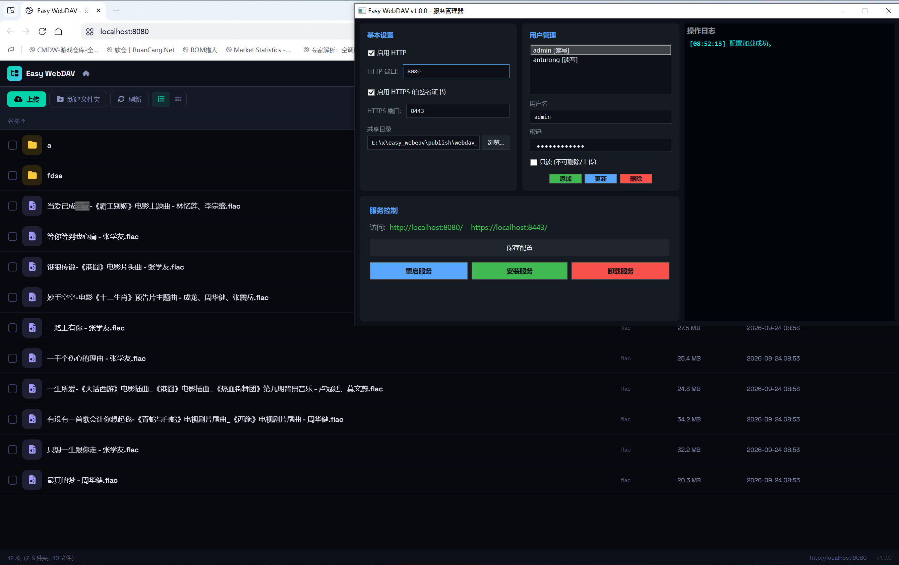

# Easy WebDAV

**⚠️ 试验性工具 — 禁止用于实际生产环境**

这是一个个人学习/试验性质的 WebDAV 文件服务器实现，功能不完善，安全性未经审计，**严禁用于任何实际生产环境或公网部署**。



## 关于密码

本软件不包含任何硬编码密码。首次运行时会自动生成随机管理员密码并写入 `webdav_config.json` 配置文件，控制台或弹窗会显示初始密码。

## 功能

- WebDAV 文件服务（HTTP/HTTPS）
- 多用户管理、读写权限控制
- WPF 图形管理界面
- 自签名 SSL 证书自动生成
- Windows 防火墙规则配置
- 安装/卸载为 Windows 服务

## 下载

从 [Releases](https://github.com/anturong/easy_webeav/releases) 下载最新版本，有两种包可选：

| 包 | 大小 | 说明 |
|---|---|---|
| `Easy_WebDAV_v1.1.0_win-x64.zip` | ~67 MB | **自包含版**，已打包 .NET 8 运行时，解压即用，无需额外安装 |
| `Easy_WebDAV_v1.1.0_win-x64_fd.zip` | ~1.1 MB | **精简版**，需系统已安装 [.NET 8 运行时](https://dotnet.microsoft.com/zh-cn/download/dotnet/8.0) |

解压后以管理员身份运行 `WebDAVConfigurator.exe` 即可。

## 自行编译

```bash
dotnet publish src/WebDAVService/WebDAVService.csproj -c Release -r win-x64 -o publish
dotnet publish src/WebDAVConfigurator/WebDAVConfigurator.csproj -c Release -r win-x64 -o publish
publish/WebDAVConfigurator.exe
```

## 同类工具对比

| 方案 | 类型 | 图形管理 | 上手难度 | 平台 |
|---|---|---|---|---|
| **Easy WebDAV（本工具）** | 独立服务端 | ✅ WPF 界面 | 极低 | Windows |
| IIS WebDAV | Windows 内置模块 | ❌ 需 IIS 管理器 | 高 | Windows Server |
| Apache mod_dav | 独立服务端 | ❌ 配置文件 | 高 | 跨平台 |
| Nginx dav_module | 独立服务端 | ❌ 配置文件 | 高 | 跨平台 |
| Cerberus FTP Server | 商业产品 | ✅ | 低 | Windows |
| Serv-U | 商业产品 | ✅ | 低 | Windows |

本工具的优势在于：**Windows 原生 .NET 开发、零外部依赖、WPF 图形配置界面、一键安装服务**，适合快速在 Windows 上搭建 WebDAV 服务。劣势是试验性质，未经安全审计，不适合生产环境。

## License

MIT
